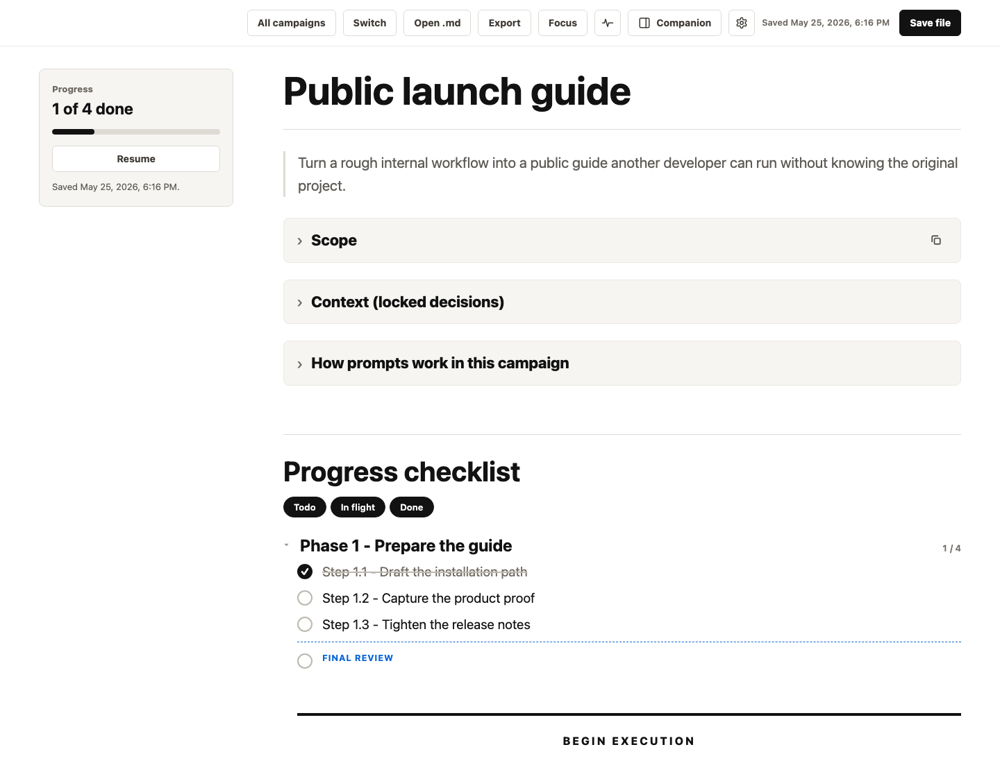
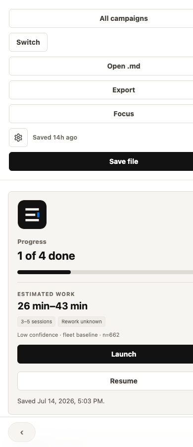
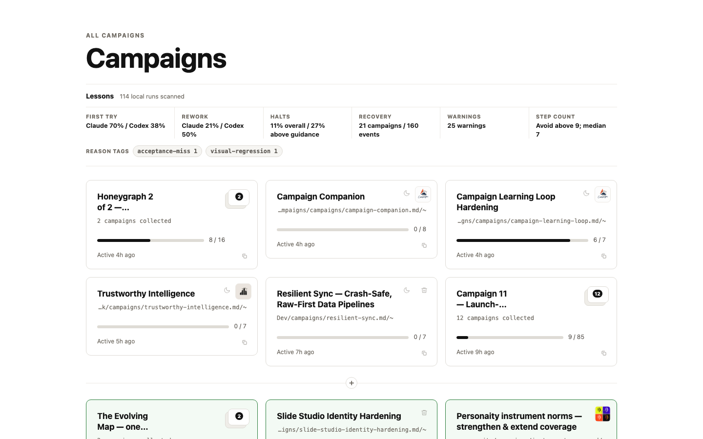

# Campaigns

Plan work in markdown. Run it with a coding agent. Watch progress, activity, and review evidence from one local board.



*Plan → run → watch: the checklist stays in the markdown file while the activity drawer shows the current step and its evidence.*

[Replay a real run — no install, no writes →](https://christian-katzmann.github.io/Campaigns/)

## Five-minute quickstart

You need Node.js 20+ and either Claude Code or Codex installed and signed in.

Open the included sample board with no install:

```bash
npx campaigns-app
```

The command binds to `127.0.0.1`, opens the board in your browser, and keeps the
local server in that terminal. Press Ctrl+C when finished. For an unattended
smoke test, use `npx campaigns-app --no-open --port 0`.

Install the engine command when you are ready to run your own campaign:

```bash
npm install --global campaigns-app
campaigns run path/to/your-campaign.md --runner codex
```

For source development, clone the repository and run `npm link --silent`.
`./install.sh` is the equivalent Bash helper on macOS and Linux.

Open the URL printed by the server. It defaults to `http://localhost:4178`.
From a source checkout, keep that terminal running and start the bundled sample
in a second terminal:

```bash
cd Campaigns
campaigns run examples/sample-campaign.md
```

The default runner is Claude Code. To use Codex, add `--runner codex`. Open the activity button in the board to follow the live step, then watch the same markdown checkboxes advance as receipts land.

## Plan → run → watch

### 1. Plan in markdown

A campaign is an ordinary Markdown file with phases, checklist items, and a fenced prompt for each step. New files created in the app use `<slug>.campaign.md`; existing `.md` campaign files remain fully supported. Start from [the sample campaign](examples/sample-campaign.md), create one in the app, or use the [paste-anywhere planner prompt](docs/paste-anywhere-planner.md).

### 2. Run with your agent

```bash
campaigns run path/to/your-campaign.md --runner codex
```

Campaigns executes the next unchecked step, saves a receipt, checks the markdown item only after successful verification, and ends with the campaign's final review. Run caps, stopping, recovery, and path containment are documented in [Running campaigns](docs/running-campaigns.md).

### 3. Watch the real work

Run the local board against the same file:

```bash
npm start -- --file path/to/your-campaign.md
```

The board reads progress from disk and the activity drawer reads the local run ledger. There is no second project database to reconcile.

## In CI

Run a capped campaign from a same-repository pull request with the [Campaigns in CI guide](docs/campaigns-in-ci.md). The GitHub Action publishes redacted evidence, one sticky PR comment, and a check run.



## Power-ups

- **Planning skills:** the optional Campaigns skills package adds `campaign-planner` and `automate-campaign`. From that package directory, run `node bin/install.mjs --claude` or `node bin/install.mjs --codex`.
- **Desktop launcher:** package the macOS wrapper with `npm run desktop:build`; the Node server remains the portable path.
- **Notifications and local integrations:** they are off unless configured. See [Optional integrations](docs/optional-integrations.md) for detection and environment variables.
- **Public assets:** regenerate every README screenshot, the social preview, and the local trailer with `npm run assets:render` on macOS.
- **Recorded replay:** build the self-contained static demo with `npm run replay:build`.

## What this is not

- Not a hosted project manager or team workspace.
- Not a replacement for GitHub Issues, Linear, or source-control history.
- Not a cloud sync layer. Campaigns reads and writes local markdown files.
- Not an agent sandbox. The engine contains execution paths and processes; the selected agent CLI still owns its permissions.

## Markdown reference

Any markdown file opens. These conventions unlock the execution board:

| Markdown | Meaning |
| --- | --- |
| `## Progress checklist` | The progress ledger |
| `### Phase N — Title` | A phase on the board |
| `- [ ] Step N.M — Name` | An executable step |
| `## Step N.M — Name` | The step's detail section |
| `Model:` and `Parallel:` | Runner and scheduling guidance shown with the step |
| ``Lane: `public/**`, `test/**` `` | Backtick-quoted repo-relative write globs used to prove parallel steps are disjoint |
| A fenced block inside the step | The prompt sent to the agent |
| `CHECK: {"command":"npm test"}` inside the prompt | An executable acceptance check |
| `- [ ] Final review` + `## Final review` | One campaign-level release gate |

The markdown file is the source of truth. Browser edits use a `baseHash`; stale writes return `409` instead of overwriting newer disk changes.

See the [Campaign Markdown v1 specification](docs/spec/campaign-md-v1.md) for the versioned grammar, executable `CHECK` format, and conformance rules.

## CLI reference

| Command | Purpose |
| --- | --- |
| `campaigns run <campaign.md>` | Run or resume the next unchecked unit |
| `campaigns stop <campaign.md>` | Stop at a safe boundary, then terminate after the grace period |
| `campaigns recover <campaign.md>` | Repair a stopped or failed run ledger |
| `campaigns config doctor [campaign.md]` | Show resolved config, sources, root, and warnings |
| `npx campaigns-app` | Open the bundled sample board without installing |
| `npm start -- --file <campaign.md>` | Open one campaign in the local board |
| `npm run start:sample` | Open the included sample campaign |

Run `campaigns --help` for runner, model, branch, state-directory, config, and
run-cap options. Configuration precedence and platform paths are documented in
[Running campaigns](docs/running-campaigns.md#configuration).

## Server and API reference

Useful server settings:

| Setting | Purpose |
| --- | --- |
| `--file <path>` / `CAMPAIGN_FILE` | Campaign to open |
| `--port <number>` / `PORT` | Loopback server port |
| `CAMPAIGNS_REGISTRY_DIR` | Registry and app-state directory |
| `CAMPAIGNS_PORT_FILE` | Port-discovery file for paired tools |
| `CAMPAIGNS_RUNS_DIR` | Run-ledger directory |

Local endpoints used by the app and paired tools:

| Endpoint | Purpose |
| --- | --- |
| `GET /api/registry` | List registered campaigns |
| `POST /api/registry` | Register a campaign file |
| `DELETE /api/registry` | Remove a missing campaign from the registry |
| `GET /api/document?id=<id>` | Read markdown and its current hash |
| `PUT /api/document?id=<id>` | Save markdown with conflict protection |
| `GET /api/automate-state?id=<id>` | Read live local execution state |
| `POST /api/run/stop` | Request a controlled stop |

Registering a file uses an absolute path:

```json
{
  "filePath": "/absolute/path/to/campaign.md",
  "logoPath": "/optional/path/to/logo.svg"
}
```

## Platform support

- The board, local server, and execution engine run on macOS and Linux; the full suite runs on both in CI. Windows paths, spawning, and signals received a static audit for v1.
- `npm install --global campaigns-app` is the cross-platform CLI install. `npm link --silent` remains the source-checkout development install; `./install.sh` is a macOS/Linux convenience wrapper.
- The desktop launcher and native alerts are macOS-only. Remote notifications and the browser UI remain cross-platform.
- Windows engine limits in v1: Node cannot directly launch `.cmd`/`.bat` agent shims without a shell, and forced stops signal only the direct agent process. Use a native agent executable; descendants started by it may need manual cleanup.
- The optional public-asset renderer is macOS-only and is not required to plan, run, or watch campaigns.

## Local state

| Platform | Registry | Port file |
| --- | --- | --- |
| macOS | `~/Library/Application Support/Campaigns/registry.json` | `~/Library/Logs/Campaigns/server.port` |
| Linux | `${XDG_DATA_HOME:-~/.local/share}/campaigns/registry.json` | `${XDG_STATE_HOME:-~/.local/state}/campaigns/server.port` |
| Windows | `%APPDATA%\Campaigns\registry.json` | `%LOCALAPPDATA%\Campaigns\server.port` |

Small per-file display preferences live in browser `localStorage`, keyed by campaign path. See [the architecture map](docs/architecture.md) for the full module and persistence boundaries.



## Contributing

Issues and small pull requests are welcome. See [CONTRIBUTING.md](CONTRIBUTING.md) for setup, checks, and repository etiquette.

## Decisions

- [Markdown remains the source of truth](docs/decisions/0001-markdown-source-of-truth.md)
- [Local registry and port-file contract](docs/decisions/0002-local-registry-port-contract.md)
- [No hosted live demo yet](docs/decisions/0003-no-hosted-live-demo-yet.md)
- [Unified run state](docs/decisions/0004-unified-run-state.md)

## License

MIT.
