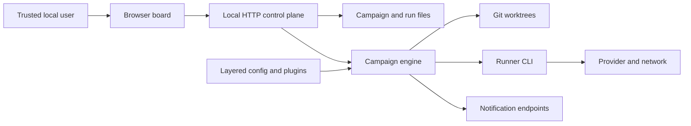

# Campaigns threat model

## Executive summary

Campaigns is a local, single-user control plane for autonomous coding agents.
Its highest risks are exposing the unauthenticated HTTP API beyond loopback and
granting a compromised or misdirected runner the user's OS/network authority.
Git worktrees, cwd checks, process-group control, atomic state, and redaction
reduce accidents and evidence leakage; none is an agent sandbox.

## Scope and assumptions

In scope: `server.mjs`, `campaigns.config.json`, `lib/config.mjs`,
`lib/runners.mjs`, `lib/runner-process.mjs`, `lib/pump.mjs`,
`lib/run-state-store.mjs`, `lib/redaction.mjs`, `lib/registry.mjs`, and the
browser control surfaces under `public/`.

Assumptions:

- The intended deployment is one trusted user on a local workstation.
- The default loopback listener is used unless the operator deliberately adds a
  trusted authenticated proxy and network controls.
- Campaign files, repositories, runner plugins, and layered config are
  operator-selected inputs; repository content may still be untrusted.
- The runner CLI and its provider account are separate trust domains.
- CI, package publishing, and third-party runner internals are out of scope.

Open questions that would change the ranking: whether non-loopback deployments
exist, whether repositories routinely contain production secrets, and whether
multiple OS users share one Campaigns data directory.

## System model

### Primary components

- Browser board: edits markdown and calls the local API (`public/app.js`,
  `public/modules/board.mjs`, `public/modules/automate-drawer.mjs`).
- HTTP control plane: routes document, registry, worktree, notification, and run
  actions (`server.mjs`, `createServer()`).
- Campaign engine: resolves config, creates worktrees, runs steps/reviews, and
  transitions the ledger (`lib/pump.mjs`, `runCampaign()`).
- Runner adapter: validates runner definitions and spawns the selected CLI
  without a shell (`lib/runners.mjs`, `lib/runner-process.mjs`).
- Local persistence: campaign markdown, registry, run state, events, receipts,
  logs, and Git branches/worktrees (`lib/registry.mjs`,
  `lib/run-state-store.mjs`, `lib/pump.mjs`).
- External destinations: runner provider/network plus optional ntfy and webhook
  notifications (`lib/notifications.mjs`).

### Data flows and trust boundaries

- Browser → HTTP server: JSON, markdown, paths, and run commands over local HTTP.
  The server has body/endpoint validation but no authentication, TLS, origin
  enforcement, or rate limiting. Loopback binding is the primary boundary
  (`server.mjs`, `createServer()` and `runCli()`).
- HTTP server → repository/data directory: document and registry operations use
  registered/canonical paths and atomic writes; document saves retain the
  `baseHash` conflict contract (`server.mjs`, `saveDocument()`;
  `lib/registry.mjs`, `writeFileAtomic()`).
- Engine → runner process: prompts, repo path, model, effort, environment, and
  output paths cross via argument arrays/stdin. Campaigns fixes and validates
  cwd, removes configured environment variables, and controls a process group;
  the runner retains the user's OS/network permissions (`lib/runners.mjs`,
  `buildRunnerInvocation()`; `lib/runner-process.mjs`, `runRunnerInvocation()`).
- Engine → Git worktree: steps normally execute in an engine-created worktree;
  `--no-worktree` deliberately runs on the campaign branch (`lib/pump.mjs`,
  `ensureExecutionWorktree()`; `docs/running-campaigns.md`).
- Engine → run artifacts: state and JSONL events are validated/redacted and
  written atomically; logs/output use streaming or staged redaction
  (`lib/run-state-store.mjs`, `persistRunState()`;
  `lib/redaction.mjs`; `lib/runner-process.mjs`, `stageRunnerOutput()`).
- Operator config/plugin → runner adapter: a manifest chooses an executable,
  arguments, inherited environment, and completion extraction. Manifests are
  validated and ID collisions skipped, but an accepted executable is trusted
  code (`lib/config.mjs`; `lib/runners.mjs`, `loadRunnerPlugin()`).

#### Diagram

## Assets and security objectives

| Asset | Why it matters | Objective |
| --- | --- | --- |
| Source repositories and Git history | Runner or control-plane actions can alter or delete valuable work | I/A |
| Local credentials and environment | Powerful runners may read tokens outside the repo | C/I |
| Campaign markdown and registry | They select work, paths, and user-visible progress | I/A |
| Run state, receipts, logs, events | Evidence guides retries, review, recovery, and sharing | C/I/A |
| Runner/provider account | Can spend quota and access provider-side transcripts/tools | C/I/A |
| Workstation compute/network | Unbounded or hostile runs can consume resources or reach other systems | C/I/A |

## Attacker model

### Capabilities

- A remote host can call all HTTP routes if the operator exposes the listener
  without a protective proxy/firewall.
- Repository content, campaign prompts, or model output can attempt to steer a
  runner beyond the user's intended task.
- A malicious local config or runner plugin can select an arbitrary executable
  and inherited environment.
- A runner/provider compromise acts with the CLI permission mode and OS identity
  chosen by the user.

### Non-capabilities

- Under the default loopback deployment, an unaffiliated remote attacker cannot
  directly reach the listener.
- Campaigns does not grant a runner more OS privilege than the user process
  already has.
- A repository contributor cannot install config/plugins or launch a campaign
  unless the operator or another trusted workflow accepts and runs that input.

## Entry points and attack surfaces

| Surface | How reached | Boundary | Notes | Evidence |
| --- | --- | --- | --- | --- |
| HTTP API | Listener port | Network → control plane | Read/write/run/delete operations, no app auth | `server.mjs`, `createServer()` |
| Campaign markdown | Registered file/API | File → parser/runner prompt | Operator-selected; content may be adversarial | `lib/pump.mjs`, `parseCampaignPlan()` |
| Layered config | Project/user/explicit/env/CLI | Config → engine | Later layers win; runner definitions replace whole | `lib/config.mjs`, `resolveCampaignConfig()` |
| Runner plugin manifest | `runnerPaths` | Plugin → process spawn | Validated JSON still selects executable/args | `lib/runners.mjs`, `loadRunnerPlugin()` |
| Runner stdout/stderr/output | Child process streams/files | Runner → persistence/UI | Redacted before persistence; raw provider transcript is external | `lib/runner-process.mjs` |
| Notification settings | Settings API/config | Control plane → network | Sends operator-configured payloads outward | `lib/notifications.mjs` |
| Git/worktree actions | Run, rollback, cleanup APIs | Engine → repository | High-integrity operations with locks/status checks | `lib/pump.mjs`, `lib/worktrees.mjs` |

## Top abuse paths

1. Operator binds to a non-loopback host → attacker reaches the unauthenticated
   API → attacker edits a campaign or starts a runner → runner executes with the
   operator's configured permissions → repository/credential compromise.
2. Malicious repository text enters a campaign prompt → runner follows the
   adversarial instruction → full-permission CLI reads outside the worktree or
   uses the network → secrets leave the workstation.
3. Malicious local/project config adds a runner plugin → validated manifest
   selects an attacker executable → engine starts it as the user → arbitrary
   local code execution.
4. Runner prints an unusual secret format → pattern redaction misses it → value
   persists in logs/receipts/events → artifact is shared or read by another user.
5. Misdirected runner makes destructive Git/file changes → worktree limits the
   immediate checkout → finalize/merge or `--no-worktree` carries damage into a
   valued branch.
6. Exposed or malicious client repeatedly starts runs/notifications → process,
   quota, disk, or outbound-network exhaustion → local denial of service/cost.

## Threat model table

| ID | Source | Prerequisites | Action and impact | Existing controls | Gaps / recommended mitigations | Detection | Likelihood | Impact | Priority |
| --- | --- | --- | --- | --- | --- | --- | --- | --- | --- |
| TM-001 | Remote network client | Non-loopback listener reachable without a trusted proxy | Calls mutation/run APIs and gains indirect code execution or deletes work | Loopback default in `server.mjs` | Never expose directly; require operator-managed auth, TLS, and network ACLs for remote access | Log bind address and run/file mutation events | Low by default; high if exposed | High | High |
| TM-002 | Compromised/misdirected runner | Campaign executed with bundled powerful modes | Reads credentials, changes files, or uses network as the user | cwd containment, worktrees, process groups, caps (`lib/pump.mjs`, `lib/runner-process.mjs`) | Use least-privilege CLI modes, scoped credentials, disposable worktrees/accounts; treat prompts/repo text as untrusted | Review JSONL events, Git diff, provider audit data | Medium | High | High |
| TM-003 | Malicious config/plugin | Attacker can change a trusted config layer or `runnerPaths` | Selects arbitrary executable/args/environment and obtains user-level code execution | Manifest validation, explicit discovery, collision rejection (`lib/runners.mjs`) | Protect config paths; review diffs; keep plugin paths explicit; do not accept runner config from untrusted repos | `campaigns config doctor`; config/version-control alerts | Low | High | Medium |
| TM-004 | Runner output or repo secret | Secret reaches model/process output and evades patterns | Sensitive value persists or is shown in UI/shared artifacts | Streaming/staged/state redaction and atomic writes (`lib/redaction.mjs`) | Keep secrets out of prompts, scope tokens, restrict data-dir permissions, review artifacts before sharing | Secret scanning on run directories and commits | Medium | Medium | Medium |
| TM-005 | Misdirected runner/operator | Destructive change passes review or `--no-worktree` is used | Source/history loss or incorrect merge | Default worktree, locks, conflict-safe saves, review/finalize gates (`lib/pump.mjs`) | Keep backups/remotes, avoid `--no-worktree`, inspect final diff, use branch protection where appropriate | Git reflog/status and finalize receipts | Medium | Medium | Medium |
| TM-006 | Remote/local abusive client | API reachable or local process can call it | Repeated runs, large output, notifications, or provider spend cause DoS/cost | Step/time caps, watchdog, stop requests (`campaigns.config.json`, `lib/runner-process.mjs`) | Keep listener local; choose tighter caps; add proxy rate limits if remotely fronted | Run duration, event sequence, disk/quota monitoring | Low | Medium | Low |

## Criticality calibration

- Critical: default-reachable unauthenticated OS-level execution, cross-user
  credential theft, or unrecoverable repository destruction at scale. None is
  assumed under the loopback single-user model.
- High: non-loopback API takeover; runner compromise with user-level secret or
  repository access; silent destructive finalize into a valued branch.
- Medium: local plugin execution requiring config write access; secret leakage
  through artifacts; recoverable repository integrity loss.
- Low: noisy local resource exhaustion, low-sensitivity status disclosure, or
  issues requiring a malicious user who already holds equivalent OS access.

## Focus paths for security review

| Path | Why it matters | Threats |
| --- | --- | --- |
| `server.mjs` | Unauthenticated control-plane routing and bind behavior | TM-001, TM-006 |
| `lib/http.mjs` | Request body limits, static paths, and response handling | TM-001, TM-006 |
| `lib/pump.mjs` | Worktree, merge, caps, locks, and runner orchestration | TM-002, TM-005, TM-006 |
| `lib/runner-process.mjs` | Process spawn, cwd containment, stop behavior, and log capture | TM-002, TM-004 |
| `lib/runners.mjs` | Plugin validation and executable/argument construction | TM-002, TM-003 |
| `lib/config.mjs` | Trust and precedence of permission-bearing config | TM-003 |
| `lib/redaction.mjs` | Best-effort secret detection before persistence | TM-004 |
| `lib/run-state-store.mjs` | Integrity and ordering of audit evidence | TM-004, TM-005 |
| `lib/worktrees.mjs` | Destructive cleanup and live-worktree protection | TM-005 |
| `lib/notifications.mjs` | Outbound destinations and stored webhook settings | TM-004, TM-006 |

This model covers the discovered HTTP, file/config, process, Git, persistence,
and outbound-network boundaries. It separates runtime from CI/package tooling
and records unvalidated deployment assumptions above.
